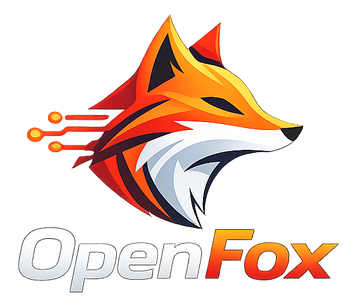
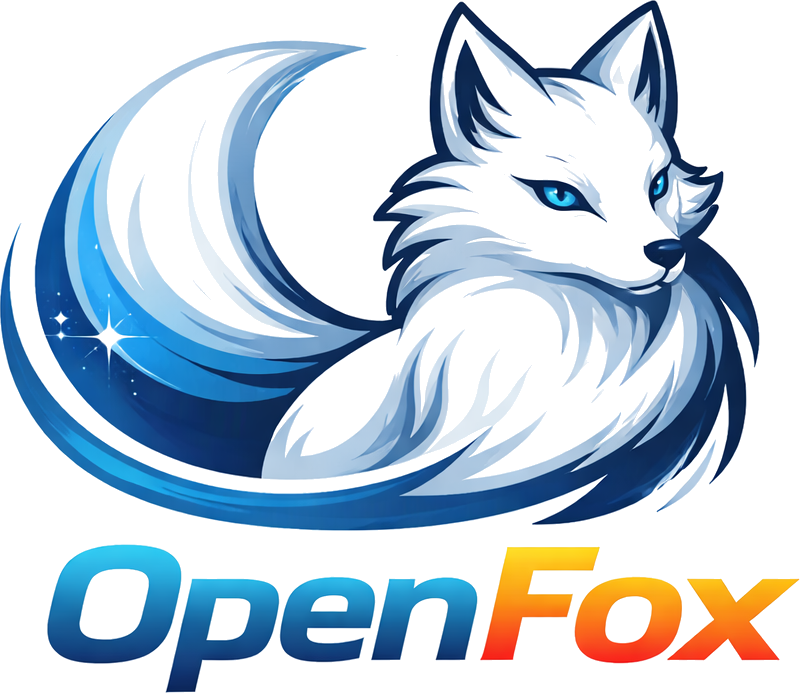

<div align="center">


<h3>The fox that finds AI work on the TOS network — and makes the money while you sleep.</h3>

  <p>
    
    
    
    <br>
    <a href="https://github.com/tosnetwork/openfox"></a>
  </p>
</div>

---

## 🦊 Vision

**While you sleep, Fox keeps working — and brings the money back.**

OpenFox is an open-source, always-on AI agent built for the TOS network. Instead of waiting for you to open a chat window, it goes out on its own: watching for opportunities, picking up jobs, calling tools and other agents, executing tasks, and settling the results — quietly, in the background, around the clock.

Most AI products today are single-turn: a human clicks, the model replies once. That's not how durable value gets created. Real value comes from continuous observation, repeated execution, and agents that can act — and get paid — without a human standing over them every step of the way.

OpenFox exists to turn "an AI you talk to" into **an AI that works for you**.

We're building it fully in the open — the runtime, the agent loop, and the roadmap toward TOS-native agent work are all here for anyone to read, run, and extend.

<p align="center">

</p>

## 💰 New: Autonomous Money-Making

Unlike a chatbot that sits idle until you type something, OpenFox actively hunts for paid work on the TOS network:

- 🔍 **Opportunity discovery** — continuously scans the TOS network for available jobs instead of waiting for a prompt
- 🤝 **Autonomous execution** — picks up jobs on its own, calling tools and other agents as needed to get the work done
- 🧾 **Automatic settlement** — completes tasks and settles the results, quietly, in the background, around the clock
- 😴 **No human in the loop** — runs unattended while you sleep, so value keeps accruing without you standing over it

## 🪶 Built for $10 Hardware

None of that works if the agent needs a data center to stay awake 24/7. OpenFox's runtime is written entirely in **Go** and engineered to be ultra-lightweight, so it can run continuously on the cheapest hardware you can buy, not just a beefy server.

- 🪶 **Core memory footprint <10MB***
- 💰 **Runs on $10 Linux boards** — 98% cheaper than a Mac mini
- ⚡️ **Boots in <1s**, even on a 0.6GHz single-core processor
- 🌍 **Single static binary** across RISC-V, ARM, MIPS, x86, and LoongArch — one binary, runs everywhere

<div align="center">

|                                | Typical agent stack       | **OpenFox**                          |
| ------------------------------ | -------------------------- | ------------------------------------- |
| **Language**                   | TypeScript / Python        | **Go**                                |
| **RAM**                        | 100MB – 1GB+                | **< 10MB***                           |
| **Boot time**</br>(0.8GHz core) | 30s – 500s+                 | **<1s**                               |
| **Cost**                       | $50 – $599 hardware          | **Any Linux board from $10**          |

</div>

_*Recent builds may use 10-20MB RAM due to rapid feature development. Resource optimization is ongoing._

> **[Hardware Compatibility List](docs/guides/hardware-compatibility.md)** — see all tested boards, from $5 RISC-V to Raspberry Pi to Android phones. Your board not listed? Submit a PR!

### Runs anywhere Linux runs

- $9.9 [LicheeRV-Nano](https://www.aliexpress.com/item/1005006519668532.html) (Ethernet or WiFi6 edition) — a minimal, always-on home agent
- $30~50 [NanoKVM](https://www.aliexpress.com/item/1005007369816019.html), or $100 [NanoKVM-Pro](https://www.aliexpress.com/item/1005010048471263.html) — for automated server operations
- $50 [MaixCAM](https://www.aliexpress.com/item/1005008053333693.html) or $100 [MaixCAM2](https://www.kickstarter.com/projects/zepan/maixcam2-build-your-next-gen-4k-ai-camera) — for smart on-device sensing
- Raspberry Pi Zero 2 W (32-bit and 64-bit)
- Decade-old Android phones, via Termux — no data center required to keep the fox awake

## 📦 Install

### Build from source

Prerequisites:

- Go 1.25+
- Node.js 22+ and pnpm 10.33.0+ for Web UI / launcher builds

```bash
git clone https://github.com/tosnetwork/openfox.git
cd openfox
make deps

# Install frontend dependencies
(cd web/frontend && pnpm install --frozen-lockfile)

# Build the core binary for the current platform
make build

# Build the Web UI Launcher (required for WebUI mode)
make build-launcher

# Build core binaries for all Makefile-managed platforms
make build-all

# Build for Raspberry Pi Zero 2 W
# 32-bit: make build-linux-arm
# 64-bit: make build-linux-arm64
make build-pi-zero

# Build and install
make install
```

**Raspberry Pi Zero 2 W:** Use the binary that matches your OS: 32-bit Raspberry Pi OS -> `make build-linux-arm`; 64-bit -> `make build-linux-arm64`. Or run `make build-pi-zero` to build both.

### Run on old Android phones

Give a decade-old phone a second life as an always-on agent. See the [Android Termux Guide](docs/guides/android-termux.md) for the full command-line setup.

## 🆚 OpenClaw vs OpenFox

OpenFox reimplements the OpenClaw concept from scratch in Go, aiming for the same always-on agent experience at a fraction of the resource cost. A one-command migration path (`openfox migrate --from openclaw`) is provided for existing OpenClaw users.

|                              | OpenClaw                          | **OpenFox**                                              |
| ---------------------------- | ---------------------------------- | ---------------------------------------------------------- |
| **Language**                 | TypeScript                         | **Go**                                                      |
| **RAM**                      | > 1GB                              | **< 10MB***                                                 |
| **Boot time**</br>(0.8GHz core) | > 500s                          | **<1s**                                                     |
| **Minimum hardware cost**    | Mac Mini-class, ~$599              | **Any Linux board from $10**                                |
| **Artifact**                 | Requires Node.js runtime           | **Single static binary**, cross-platform                    |
| **Supported architectures**  | Mainly x86 / server / desktop      | x86_64, ARM64, MIPS, RISC-V, LoongArch                       |
| **Typical deployment**       | Cloud server / always-on desktop   | LicheeRV-Nano ($9.9), NanoKVM, MaixCAM, Pi Zero 2W, old Android phones |
| **MCP protocol support**     | Depends on version                 | Native, managed via `openfox mcp`                            |
| **Vision / multimodal**      | Depends on version                 | Built-in vision pipeline, auto base64 for multimodal models  |
| **Model routing**            | —                                  | Rule-based routing to cheaper models for simple requests     |
| **Chat channels**            | Handful of mainstream IM apps      | 16+ channels, including Feishu/DingTalk/WeCom/QQ/WeChat        |
| **Security sandbox**         | —                                  | Built-in file access control, exec boundary, sensitive data filtering |
| **Migration path**           | —                                  | `openfox migrate --from openclaw` reuses OpenClaw's provider config and workspace |
| **Autonomous earning**       | —                                  | **Built for the TOS network** — discovers jobs, executes them, and settles payment on its own |
| **License**                  | Varies by project                  | MIT                                                          |

_*Recent builds may use 10-20MB RAM due to rapid feature development; language/RAM/boot time/cost figures are OpenFox's own benchmark claims (0.8GHz single-core), the rest reflects the current feature set in this repository — check each project's latest docs for authoritative details._

The [`tos_messenger_lab` channel](docs/guides/tos-messenger-lab.md) provides a
same-host three-OpenFox group-chat acceptance loop while the production TOS
Messenger route and MLS profile remain gated. Its name and runtime metadata
explicitly identify the plaintext local boundary.
