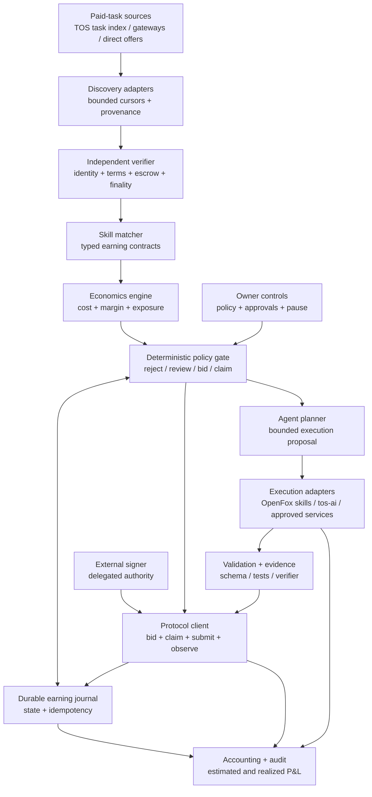

# Autonomous Earning Agent Implementation Plan

## Status

- Document type: design proposal and implementation plan
- Status: proposed, non-normative
- Target repository: `tosnetwork/openfox`
- Scope: an owner-controlled agent that discovers paid work, competes for it,
  executes it with approved skills, settles payment, and operates continuously
  under bounded economic policy

This document turns OpenFox's autonomous-earning product promise into a
concrete implementation plan. It complements the ecosystem-level
[OpenFox autonomous earning agent proposal][ecosystem-proposal] by auditing
the code that exists in this repository and defining the remaining OpenFox
work.

[ecosystem-proposal]: https://github.com/tosnetwork/doc/blob/main/tos-blockchain/openfox-autonomous-earning-agent.md

## Executive Summary

OpenFox does not yet implement the complete loop described in the project
README:

```text
discover paid demand
  -> verify terms and payment
  -> estimate profit and risk
  -> bid or claim
  -> execute with approved skills
  -> validate and submit the result
  -> observe settlement
  -> reconcile realized profit
  -> repeat
```

The repository contains credible foundations for parts of this loop:

- `pkg/opportunity` periodically discovers and verifies TOS service
  capabilities and can advance policy-gated purchases.
- `pkg/servicebridge` implements buyer and provider projections for Quote,
  escrow, task execution, Receipt, and settlement flows.
- `pkg/servicebridge/nativeimpl` contains compilable native buyer, provider,
  purchase, and opportunity-coordinator commands.
- `pkg/actionauth` provides a narrow authorization seam for spend, key use,
  tool calls, configuration changes, and other side effects.
- the agent runtime provides skills, tools, routing, scheduled work, durable
  sessions, event provenance, isolation, and self-evolution infrastructure.

However, these foundations do not currently form an autonomous earning
product. The opportunity service is buyer-oriented: it discovers capabilities
that OpenFox can purchase. The provider service is seller-oriented but passive:
it waits for a funded task and currently exposes one fixed, bounded Go testing
contract. There is no production control plane that discovers paid task
demand, matches it to approved skills, computes conservative profit, bids or
claims, dispatches execution, submits results, and maintains a realized P&L
ledger.

Deploying the existing binaries is therefore sufficient to operate a narrow,
passive paid Go-testing provider, but it is not sufficient to deliver the
autonomous earning promise. Both deployment work and new product development
are required.

## Goal

Build OpenFox into:

> An owner-controlled agent that continuously finds diverse profitable tasks,
> competes for work, executes accepted tasks through approved skills and
> capacity, proves delivery, receives payment, and keeps operating without
> exceeding deterministic safety, budget, or authority limits.

"Autonomous" means that the owner may delegate bounded decisions in advance.
It does not mean that OpenFox owns the wallet, can expand its own authority, or
may optimize profit ahead of safety, law, privacy, or explicit owner policy.

## Current-State Audit

### What exists today

| Area | Existing implementation | What it proves |
|---|---|---|
| Capability discovery | `pkg/opportunity`, `pkg/gateway/opportunity.go`, and `tos-service-opportunity-coordinator` | OpenFox can perform bounded recurring searches and independently verify finalized capability identity. |
| Policy-gated purchasing | `pkg/opportunity.Service.advancePurchase` and the native purchase coordinator | OpenFox can mirror a crash-safe buyer flow without holding custody in the AgentLoop process. |
| Provider execution | `pkg/servicebridge.Provider` and `tos-service-provider` | A funded task can pass an execution gate, run once in a bounded executor, produce a Receipt, release escrow, and reconcile provider credit. |
| Authorization | `pkg/actionauth` | Sensitive effects can be separated from model planning and committed with retry-stable idempotency keys. |
| Agent execution | `pkg/agent`, skills, tools, isolation, and turn profiles | OpenFox can plan and invoke bounded local capabilities. |
| Scheduling and durability | cron, heartbeat, JSONL/SQLite stores, runtime events, and journals | Long-running background workflows and restart-safe records are established patterns in the repository. |
| Learning | `pkg/evolution` | Completed work can produce learning records and reviewable skill drafts. |

### What deployment alone can enable

With production configuration, a registered Agent identity, TOS RPC quorum,
`tosctl` custody, TLS, containerd, published endpoints, and a compatible market,
the existing provider can sell its fixed software-work capability. It can
receive a funded task, execute `go test ./... -count=1` in its pinned runtime,
and reconcile settlement.

That is a valuable vertical slice, but it is passive and specialized. It does
not search for buyers or arbitrary paid tasks.

### What remains a development gap

| Required behavior | Current gap |
|---|---|
| Discover paid demand | Current opportunity records describe provider capabilities to buy, not open tasks that pay OpenFox for completion. |
| Compete for work | No bid, claim, negotiation, reservation, or expiration control plane exists in AgentLoop. |
| Match work to skills | Markdown skills are prompt context, not typed, owner-approved commercial capability contracts. |
| Estimate profit | No deterministic cost model combines payout, success probability, compute, model/API/tool cost, fees, dispute reserve, and opportunity cost. |
| Enforce earning policy | Existing authorization primitives do not yet express task-category, minimum-margin, exposure, counterparty, or portfolio constraints. |
| Execute diverse work | The production provider command currently pins one image, toolchain, manifest, and Go test operation. |
| Validate and submit | There is no general result-validation/evidence pipeline selected by an earning skill contract. |
| Account for the business | No double-entry-style economic journal reconciles estimates, reservations, accrued costs, payouts, refunds, disputes, and realized net income. |
| Operate a portfolio | There is no capacity allocator, maximum unresolved exposure, loss circuit breaker, or profitability-aware queue. |
| Improve safely | Evolution output is not connected to verified economic outcomes, and automatic skill application must not expand live earning authority. |

## Architectural Decisions

### 1. Keep buying and earning separate

The current `pkg/opportunity` package should retain its existing buyer-facing
meaning. A verified service capability is something OpenFox may purchase; a
verified paid task is work OpenFox may perform for revenue. These objects have
opposite cash-flow directions and different authority rules.

Introduce a new `pkg/earning` control plane and top-level `earning`
configuration. Shared protocol identity types may be factored only when their
semantics are exactly identical. Do not reuse a purchase record as an earning
task record.

### 2. Keep the model outside the authority boundary

The LLM may classify a task, propose a plan, estimate uncertain work, and
explain a recommendation. Deterministic code must independently enforce:

- task and counterparty allowlists;
- skill and executor compatibility;
- price, cost, margin, loss, exposure, and concurrency limits;
- exact deadlines, finality, escrow, bid, and settlement terms;
- approval requirements;
- tool and network permissions;
- idempotency and state transitions.

Model output never directly signs, bids, claims, spends, submits, changes
policy, installs a skill, or selects credentials.

### 3. Use external, policy-enforced signing

OpenFox must not receive an unrestricted owner key. Bid, claim, task acceptance,
result submission, Receipt, and settlement actions must use narrowly delegated
keys through a signer or TOS Messenger mandate. On-chain delegation limits and
off-chain policy must both authorize an action.

### 4. Treat all market content as hostile

Task titles, descriptions, attachments, schemas, counterparty messages,
catalog fields, model output, and tool output are untrusted data. They cannot
select tools, network destinations, credentials, runtimes, plugins, MCP
servers, models, or skill revisions.

### 5. Make every economic action durable and idempotent

Every externally visible transition receives a stable key derived from the
verified task identity, exact terms, action kind, and attempt generation. A
restart, duplicate event, indexer replay, RPC ambiguity, or model retry must
not create a second bid, claim, execution, submission, or payment action.

## Repository Boundaries

| Repository or component | Responsibility |
|---|---|
| OpenFox | Discovery orchestration, skill matching, planning, economics, deterministic policy, durable task state, execution coordination, accounting, and operator controls. |
| `tos-service-protocol` | Normative task, bid, claim, quote, result, Receipt, dispute, settlement, delegation, and discovery schemas plus conformance behavior. |
| `tos-ai` and other vertical runtimes | Bounded production capacity, runtime admission, model/tool execution, resource metering, and vertical evidence. |
| TOS chain and contracts | Authoritative identity, delegation, escrow, settlement, and finalized state. |
| External signer or TOS Messenger | Custody and policy-enforced signatures; no model-facing raw key API. |

OpenFox should consume released protocol SDKs. Missing market messages must be
added to `tos-service-protocol`; they must not be improvised as private
OpenFox-only wire formats.

## Target Architecture



### Proposed package layout

```text
pkg/earning/
  types.go             # paid-task and exact economic domain types
  source.go            # bounded discovery adapter interface
  verifier.go          # authoritative verification interface
  matcher.go           # typed skill/capacity compatibility
  economics.go         # fixed-precision conservative estimates
  policy.go            # deterministic decisions and limits
  state.go             # transition rules and idempotency
  store.go             # durable bounded journal
  coordinator.go       # orchestration, no custody
  accounting.go        # estimates, reservations, accruals, realized P&L
  events.go             # redacted runtime events and metrics

pkg/earning/adapters/
  tos_tasks.go          # released TOS paid-task discovery/protocol client
  direct_offer.go       # authenticated direct offers, if standardized
  static.go             # deterministic fixtures for tests and demos

pkg/earning/execution/
  agent_skill.go        # restricted AgentLoop execution
  tos_ai.go             # bounded terminal reservation/invocation
  service.go            # approved external service dependency

cmd/openfox/internal/earning/
  command.go            # inspect, pause, resume, reconcile, and explain
```

The first implementation may keep adapters directly under `pkg/earning` if
there is only one production source. Package boundaries should follow actual
interfaces, not this diagram mechanically.

## Domain Model

### Verified paid task

A task eligible for scoring must contain or resolve to an immutable,
content-addressed record with at least:

- network and finalized checkpoint;
- task ID, revision, source, and provenance;
- buyer or requester Agent identity;
- task category and exact input commitment;
- required output schema and validation/evidence profile;
- bid or fixed-price terms, asset identity, amount, and fee responsibility;
- escrow or payment guarantee and dispute terms;
- claim, execution, submission, and settlement deadlines;
- confidentiality, retention, region, and permitted-egress constraints;
- cancellation, rejection, partial-completion, and refund behavior.

Display text and marketplace ranking remain advisory. They are never copied
into an authorization object.

### Earning skill contract

An earning-capable skill should have an owner-approved manifest adjacent to
`SKILL.md`, for example `EARNING.json`. The exact schema should be versioned
before implementation. It should declare:

- stable skill name and revision digest;
- accepted task categories and I/O schemas;
- approved execution adapter and runtime profile;
- maximum runtime, CPU, memory, disk, model tokens, API cost, and egress;
- allowlisted tools and network destinations;
- validator and evidence requirements;
- minimum payment and margin policy overrides;
- permitted data classes and retention behavior;
- retry, cancellation, and failure semantics;
- approval provenance and expiry.

The manifest grants no authority by itself. Runtime policy may narrow it but
cannot widen it. A remote task cannot create or edit this manifest.

## Durable Task State Machine

```text
DISCOVERED
  -> VERIFIED
  -> MATCHED
  -> SCORED
  -> POLICY_REVIEW
  -> BIDDING | CLAIMING
  -> ACCEPTED
  -> RESERVED
  -> EXECUTING
  -> VALIDATING
  -> SUBMITTING
  -> SUBMITTED
  -> SETTLING
  -> SETTLED

Any permitted non-terminal state
  -> REJECTED | EXPIRED | CANCELLED | FAILED | DISPUTED
```

Requirements:

- transitions are append-first and crash-safe;
- every action records the exact verified inputs and policy revision;
- terminal states cannot silently reopen;
- a new task revision creates a new identity rather than mutating accepted
  work;
- authoritative state is re-read before bid, claim, execution dispatch,
  submission, and settlement-sensitive actions;
- bounded reconciliation resumes ambiguous actions instead of repeating them;
- records, attachments, evidence, and unresolved exposure have explicit size,
  count, and retention bounds.

## Discovery and Verification

Define a narrow task-source interface with cursor-based replay:

```go
type TaskSource interface {
    Discover(ctx context.Context, cursor Cursor, limit uint32) (Batch, error)
    Verify(ctx context.Context, ref TaskRef) (VerifiedTask, error)
}
```

The concrete TOS adapter should support authenticated, provenance-preserving
discovery of open task demand. Search gateways or indexes may return hints, but
an independent verifier must resolve authoritative identity, terms, escrow,
deadline, and current availability before scoring.

Discovery must be bounded by source, query, page size, cycle count, wall-clock
time, retained candidates, and cursor history. A source that cannot provide a
stable task identity or authoritative verification is observe-only.

## Matching and Planning

Matching happens in two stages:

1. A deterministic matcher rejects tasks whose schemas, data policy, evidence,
   runtime, tools, deadlines, or resources are incompatible with every approved
   earning skill.
2. The model may propose a plan only from the compatible skill's declared
   tools and execution adapters. Deterministic validation checks the resulting
   plan before it can be scored or dispatched.

The plan should include bounded work units, predicted usage, validation steps,
external dependencies, cancellation points, and a maximum cost envelope. It
must not contain free-form authority such as "use any available tool."

## Economics Engine

All monetary values use exact asset identity and integer atomic units. Floating
point is forbidden for policy or accounting.

For each compatible plan, calculate both a conservative expected value and a
worst-case exposure:

```text
expected revenue
  = payment_atomic
    * lower_bound(success_probability)
    * lower_bound(acceptance_probability)
    * lower_bound(settlement_probability)

expected net value
  = expected revenue
    - local compute and energy cost
    - model, API, tool, and subcontractor cost
    - network, bid, and settlement fees
    - expected retry and failure cost
    - dispute and refund reserve
    - capacity opportunity cost

worst-case exposure
  = committed external spend
    + non-refundable execution cost
    + locked capital
    + dispute reserve
```

Every estimate records its source, timestamp, confidence class, and expiry.
Unknown material costs fail closed or require approval. Marketplace scores,
self-reported reputation, and LLM estimates cannot silently become trusted
prices or probabilities.

Initial probability estimates should use conservative static policy. Historical
calibration may be introduced only after enough verified outcomes exist, with
minimum sample sizes, bounded updates, holdout evaluation, and rollback.

## Policy Decisions

The policy engine returns one of:

- `reject`: incompatible or outside policy;
- `recommend`: show the owner a read-only opportunity;
- `approval-required`: prepare an exact intent for one-shot approval;
- `auto-bid`: submit a bounded bid within a delegated mandate;
- `auto-claim`: accept fixed-price work within a delegated mandate.

Policy must support:

- allowed task categories, skills, sources, buyers, assets, regions, and data
  classes;
- minimum payment, expected margin, confidence, and deadline slack;
- per-task and rolling cost, loss, and revenue-at-risk limits;
- maximum locked capital and unresolved settlement/dispute exposure;
- concurrency and capacity reservations by skill and terminal;
- maximum bid count, bid revisions, retries, and counterparty concentration;
- required validation, evidence, finality, and reputation trust tier;
- approval thresholds and quiet hours;
- global pause, source pause, skill pause, and loss circuit breakers.

The authoritative decision record commits the verified task, plan digest,
estimate digest, policy revision, requested action, and idempotency key.

## Bidding, Claiming, and Negotiation

Implement fixed-price claim before competitive bidding. It has fewer mutable
terms and a smaller recovery surface.

Competitive bidding requires protocol support for typed, expiring offers. A
bid must commit to exact task revision, price, asset, deliverable, evidence,
deadlines, skill/runtime revision, and cancellation terms. The model may
recommend a price inside a deterministic interval; it cannot choose an
unbounded amount or alter non-price terms.

Do not implement open-ended natural-language negotiation in the production
path. If a protocol adapter lacks deterministic bid/claim messages and replay
semantics, it remains scout-only.

## Execution and Validation

Accepted work is dispatched through an approved execution adapter:

- restricted AgentLoop turn using a task-specific turn profile;
- owner-operated `tos-ai` terminal capability;
- pinned `servicebridge` software-work runner;
- explicitly approved external service capability.

The coordinator passes only schema-validated inputs and content-addressed
artifacts. Execution receives no signer, owner key, policy mutation API, or
market discovery credential.

Each earning skill selects deterministic validation where possible: schema
validation, unit tests, reproducible builds, checksums, static analyzers,
verifier signatures, or bounded independent evaluation. Model review alone is
not sufficient evidence for payment-bearing submission unless the task profile
explicitly permits it and policy requires approval.

Submission records the result commitment, evidence commitment, exact task and
bid identity, executor revision, costs accrued, and a retry-stable submission
key. Large artifacts stay in bounded content-addressed storage rather than the
AgentLoop transcript.

## Settlement and Accounting

Settlement state comes from the released protocol client and finalized chain
reads. An indexer, gateway, model, or local task state cannot declare revenue
realized.

The accounting journal should record immutable entries for:

- estimated revenue and cost;
- reserved capacity and locked capital;
- bid and protocol fees;
- model/API/tool/subcontractor usage;
- accrued local execution cost;
- submitted receivables;
- released payment, refund, dispute, and write-off;
- realized gross revenue, cost, and net income by task, skill, source, buyer,
  asset, and time window.

Reconciliation compares the local journal with finalized protocol and wallet
state. Differences pause new economic actions above a configured threshold.

Owner-facing reporting must distinguish:

- offered payment;
- expected profit;
- submitted but unsettled revenue;
- finalized gross revenue;
- realized cost;
- realized net income;
- locked capital and unresolved exposure.

## Continuous Operation and Learning

The service should run as a bounded scheduler with separate queues for
discovery, verification, decisions, execution, submission, and reconciliation.
Backpressure in a later stage must reduce earlier admission rather than create
unbounded goroutines or records.

Economic learning consumes only finalized outcomes and metered costs. It may
recommend changes to estimates, skill manifests, or policy, but production
authority changes require owner review. `pkg/evolution` may receive redacted
outcome records for draft generation; `evolution.mode=apply` must not modify an
earning skill manifest, economic policy, signer mandate, or tool permissions.

## Configuration Sketch

The final schema should be introduced with normal OpenFox config migration and
validation. A possible shape is:

```json
{
  "earning": {
    "mode": "scout",
    "state_dir": "/var/lib/openfox/earning",
    "sources": ["tos-tasks"],
    "allowed_skills": ["go-test"],
    "discovery_interval_minutes": 15,
    "max_candidates_per_cycle": 100,
    "max_active_tasks": 2,
    "max_unsettled_tasks": 4,
    "policy_file": "/etc/openfox/earning-policy.json",
    "signer_socket": "/run/tos-messenger/runtime.sock",
    "mandate_id": "mandate_owner_approved",
    "approval_mode": "required"
  }
}
```

Modes should progress monotonically in authority:

| Mode | Behavior |
|---|---|
| `off` | No discovery or earning state. |
| `scout` | Discover, verify, match, and estimate; no bid, claim, execution, or signature. |
| `testnet` | Allow owner-approved deterministic tasks with testnet assets and strict limits. |
| `guarded` | Permit delegated production actions under policy and approval thresholds. |

There should be no unrestricted mode.

## Operator Interface

Add read-only inspection before mutation commands:

```text
openfox earning status
openfox earning opportunities
openfox earning show <task-id>
openfox earning explain <decision-id>
openfox earning ledger
openfox earning reconcile
```

Mutating controls require local operator authorization:

```text
openfox earning pause
openfox earning resume
openfox earning reject <task-id>
openfox earning approve <decision-id>
```

The Web UI may expose the same bounded API later. It must never display offered
payment as earned revenue or estimated profit as realized profit.

## Observability

Emit redacted runtime events for:

- discovery cycles and source failures;
- verification results and finality;
- match rejection reasons;
- estimate inputs and confidence classes;
- policy decisions and approvals;
- bid, claim, execution, validation, and submission transitions;
- settlement reconciliation;
- circuit breakers and pauses.

Metrics should include bounded queue depth, candidates processed, acceptance
rate, execution success, validation failure, settlement latency, unresolved
exposure, estimate error, gross revenue, realized cost, and realized net income.
Raw task data, secrets, prompts, private artifacts, and signer material must not
enter logs or metric labels.

## Delivery Plan

### Phase 0: contracts and truth in product status

- Define versioned `VerifiedTask`, earning policy, earning skill manifest,
  decision record, accounting entry, and adapter interfaces.
- Document which required task-market messages already exist in
  `tos-service-protocol` and open protocol changes for missing bid, claim,
  result, dispute, and cursor semantics.
- Keep README claims clearly marked as the target until the acceptance criteria
  in this document are met.
- Add deterministic fixtures and conformance vectors before network adapters.

Exit criterion: the trust boundary, cash-flow direction, state identities, and
authority for every transition are unambiguous.

### Phase 1: read-only scout

- Implement `pkg/earning` types, store, source bounds, verifier, matcher,
  economics engine, and read-only policy decisions.
- Add `EARNING.json` support without executing tasks.
- Add CLI inspection, explanations, accounting estimates, and runtime events.
- Start with static fixtures and one released read-only TOS task source.

Exit criterion: OpenFox can run for seven days, survive restarts and replay,
and produce bounded, reproducible recommendations without signatures or task
execution.

### Phase 2: guarded testnet worker

- Implement fixed-price claim only.
- Add external delegated signer integration and exact action commitments.
- Dispatch one deterministic, allowlisted skill to a pinned executor.
- Validate, submit, and reconcile testnet settlement.
- Add global pause, per-source/skill pause, exposure limits, and loss circuit
  breakers.

Exit criterion: repeated crash/replay tests prove at-most-once claim,
execution, submission, and settlement behavior for a funded testnet task.

### Phase 3: bounded production vertical

- Complete security review and adversarial testing.
- Run one audited skill and task source with conservative owner limits.
- Add finalized accounting reconciliation and approval thresholds.
- Publish an operator runbook, backup/restore procedure, and incident process.

Exit criterion: a real low-value task produces independently verifiable
delivery, finalized provider credit, correct realized P&L, and a complete audit
trail without exposing owner custody.

### Phase 4: competitive bidding and multiple skills

- Add typed expiring bids after protocol support is released.
- Add calibrated estimates, capacity-aware scheduling, and counterparty
  concentration limits.
- Support multiple reviewed execution adapters and earning skills.
- Add dispute and cancellation workflows.

Exit criterion: policy remains deterministic under concurrent bids, tasks,
failures, disputes, and settlements, and the portfolio cannot exceed aggregate
exposure limits.

### Phase 5: safe continuous improvement

- Compare estimates with finalized outcomes and publish calibration reports.
- Generate reviewable skill/economic-model proposals from successful and failed
  work.
- Add canary revisions, rollback, and minimum-sample promotion rules.

Exit criterion: learning improves measured estimate accuracy or execution
quality without automatically expanding authority or weakening policy.

## Test Strategy

### Unit and property tests

- fixed-precision arithmetic, overflow, rounding, and asset mismatch;
- policy boundary values and deny-overrides-allow behavior;
- legal and illegal state transitions;
- stable idempotency keys and canonical encodings;
- bounded stores, queues, retries, cursors, and retention;
- matcher rejection and plan validation;
- accounting invariants and reconciliation.

### Adversarial tests

- prompt injection in every market-controlled field and attachment;
- forged gateway ranking, identity, escrow, reputation, and settlement state;
- task revision replacement after scoring;
- fee, deadline, asset-decimal, and price manipulation;
- duplicate, reordered, delayed, and conflicting events;
- RPC disagreement, reorganization, ambiguous broadcast, and stale finality;
- signer refusal, timeout, crash, and conflicting response;
- executor escape attempts, decompression bombs, oversized output, and egress
  attempts;
- model attempts to select tools, credentials, endpoints, or policy;
- accounting drift and loss-circuit-breaker activation.

### End-to-end tests

- discover through finalized settlement with a deterministic task;
- restart at every state transition;
- retry every external action and prove at-most-once effects;
- owner approval, rejection, pause, revocation, and recovery;
- failed validation and disputed result;
- multi-task capacity pressure and bounded backpressure;
- long-running soak with no unbounded memory, disk, goroutine, or exposure
  growth.

## MVP Acceptance Criteria

The autonomous earning MVP is complete only when all of the following are
demonstrated on a supported TOS testnet:

1. OpenFox discovers an open paid task from a provenance-preserving source.
2. It independently verifies identity, exact terms, deadline, and funded
   payment state.
3. It matches the task to an owner-approved earning skill and rejects an
   incompatible task without model override.
4. It produces reproducible cost, exposure, and expected-margin calculations
   in atomic units.
5. Deterministic policy authorizes a bounded claim under a delegated mandate.
6. The task executes once through a pinned, sandboxed adapter.
7. Output passes the skill's declared validation and evidence checks.
8. The result is submitted once and correlated to the exact task and claim.
9. Finalized settlement credits the provider and reconciles with the local
   accounting journal.
10. The operator can explain every decision, pause the system, revoke
    delegation, restart safely, and recover without duplicate economic action.

Until these criteria are met, OpenFox should describe autonomous earning as a
target architecture rather than a deployed capability.

## Non-Goals

- unrestricted wallet, owner-key, shell, plugin, MCP, or network access;
- accepting arbitrary customer-supplied executable code;
- speculative trading, token issuance, yield farming, or borrowing to fund
  operations;
- autonomous policy expansion or self-granted permissions;
- unbounded sub-agent creation or subcontracting;
- treating model confidence, discovery ranking, or reputation as payment
  authority;
- encoding protocol or settlement rules in prompts;
- claiming revenue before finalized reconciliation;
- guaranteeing profitability.

## Open Questions

1. Which released TOS protocol surface will enumerate open paid tasks, and what
   are its cursor and finality guarantees?
2. Which initial task profile has deterministic validation and real buyer
   demand beyond the existing Go-test provider?
3. Should earning skill manifests be signed standalone documents or committed
   by an owner-signed policy bundle?
4. Which costs can be authoritatively metered by the executor, and which require
   conservative configured ceilings?
5. What is the minimum evidence required for production settlement and dispute
   handling in the first vertical?
6. Which entity owns asset price conversion for cross-asset profitability, or
   should the MVP require payout and cost in one approved stable asset?
7. What retention and privacy rules apply to commercial task inputs, outputs,
   evidence, and accounting records?

The MVP should prefer one stable asset, one deterministic task profile, one
source, and one execution adapter until these questions are resolved.
