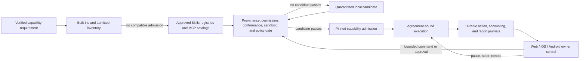

# Trusted Capabilities and Mobile Owner Control Plane

**Status:** target design; registry search/install, MCP integration, runtime
events, a Web dashboard, and cross-platform TOS Agent Commerce safety libraries
exist today, but trusted capability procurement, the finance/market built-ins,
and the mobile OpenFox operator experience described here are not implemented
end to end

This design adds three product rules to OpenFox's bounded adaptive earning
architecture:

1. Reuse an already approved capability, or acquire a compatible capability
   from an owner-approved Skills or MCP source, before developing a new one.
2. Ship maintained built-in Skills for recurring owner operations, beginning
   with financial reporting and market insight.
3. Treat iOS and Android as an authenticated human control plane for OpenFox,
   not merely as chat clients or read-only report viewers.

These rules improve reuse and operator experience. They do not weaken the
existing authority boundary: AI proposes; deterministic policy, explicit owner
grants, signed Agreement state, the Execution Gate, custody, and settlement
evidence authorize.

## Current-State Boundary

The present repository provides useful foundations:

| Surface | Present capability | Missing target behavior |
|---|---|---|
| Skills | Built-in, global, and workspace loading; registry search; GitHub and ClawHub installation; basic origin metadata; malicious-block and suspicious flags | Verified publisher identity, immutable content digest, permission manifest, conformance evidence, trust policy, revocation, and controlled updates |
| MCP | Local and remote server configuration, deferred tool discovery, tool-call events, and result spillover to artifacts | Trusted server catalog, identity and version pinning, permission review, sandbox profile, credential scope, revocation, and capability-level admission |
| Evolution | Learning records, candidate skill drafts, validation, and optional application | Reuse-first procurement, external-candidate comparison, signed promotion evidence, and isolation from vendor-installed Skills |
| Web | Authenticated dashboard, chat, skills, tools, configuration, and in-memory logs | Durable earning projections, Intent controls, financial reports, approvals, and authority-aware task steering |
| Mobile | TOS iOS and Android repositories contain matching Agent Commerce primitives for contact, spending policy, purchase phase, finality, and crash-safe funding | An OpenFox task/report/capability UI, durable event synchronization, owner steering, Intent revision, approval, and revocation flows |

An installed Skill is not therefore a trusted Skill. A configured MCP server is
not therefore a trusted server. A registry score, repository star count,
malware flag, model recommendation, or successful connection is advisory
evidence only.

## Standards Baseline

OpenFox should remain compatible with the open
[Agent Skills specification](https://agentskills.io/specification) for the
portable `SKILL.md` package shape and with a recorded version of the
[Model Context Protocol specification](https://modelcontextprotocol.io/specification/)
for external tools and data sources. MCP integrations must also follow the
official [MCP security best
practices](https://modelcontextprotocol.io/docs/tutorials/security/security_best_practices).

Those standards solve different problems:

- Agent Skills packages instructions and optional scripts, references, and
  assets for progressive discovery and loading.
- MCP defines how a client discovers and invokes server-provided tools,
  resources, and prompts.
- Neither format certifies the publisher, implementation, operational safety,
  business fitness, or truth of returned data.

OpenFox trust metadata is therefore an additional local control layer, not a
fork of either interoperability standard. The exact supported standards,
runtime implementation, and test vectors must be pinned in each release and
campaign manifest rather than following a floating `latest` label.

## Capability Supply Model

### Source classes

OpenFox distinguishes six sources:

| Source class | Meaning | Default disposition |
|---|---|---|
| OpenFox built-in | Maintained and released with OpenFox | Available, but still bounded by owner policy and runtime permissions |
| Owner-approved installed | Exact local version previously admitted by the owner | Reusable inside its recorded scope and expiry |
| Trusted-market Skill candidate | Portable Skill found in an approved registry | Untrusted until verified, tested, and admitted |
| Trusted-market MCP candidate | Server or package found in an approved catalog | Untrusted until identity, transport, permissions, and behavior are admitted |
| Local candidate | Skill or adapter drafted by OpenFox or a developer | Quarantined until reviewed and tested |
| External service provider | Human, Agent, or institution delegated a sub-obligation | A counterparty, not a local Skill; requires an exact Agreement and evidence |

“Trusted market” means that the owner trusts the catalog operator to publish
useful signed metadata and revocations. It does not mean that every listed
artifact or server is automatically trusted.

### Capability requirement

Before searching, OpenFox compiles the accepted work into a non-authoritative
`CapabilityRequirement` proposal containing:

- semantic capability and versioned input/output schemas;
- required validation and deliverable evidence;
- permitted data classifications and retention;
- maximum runtime, direct cost, latency, and resource use;
- permitted tools, filesystem roots, network destinations, and credential
  classes;
- required execution locality and data-residency constraints;
- minimum publisher, audit, conformance, freshness, and support policy; and
- whether a Skill, MCP service, local executor, or external provider may
  satisfy the requirement.

Deterministic code checks that this proposal is no broader than the accepted
Agreement and owner policy. Market-controlled Intent text, attachments, and
messages may describe desired outcomes, but they cannot name an authoritative
Skill, MCP server, install URL, command, credential, or permission grant.

### Required sourcing order

For every unmet capability, OpenFox must execute this order and retain the
decision record:

1. Match an exact OpenFox built-in or already installed owner-approved
   capability.
2. Search only configured, owner-approved Skills registries and MCP catalogs.
3. Normalize candidate identity and compare semantic fit, permissions,
   privacy, evidence, cost, latency, and operational health.
4. Verify and test the best admissible candidates without production secrets,
   real custody, or irreversible effects.
5. Ask deterministic policy and, where required, the owner to admit one exact
   version and permission set.
6. Pin and reuse the admitted capability.
7. Only if no candidate passes, create a local candidate with the rejected
   candidates and reasons attached to its provenance.

“Nothing was found” and “nothing passed” are different results. A registry
timeout, unavailable catalog, or incomplete trust record does not prove that a
capability is absent; policy decides whether the task waits, is declined, or
may enter local development.

### Candidate verification

The admission record must bind at least:

- capability kind, stable ID, publisher Agent or organization, and publisher
  key or verified account;
- registry/catalog identity, source URL, immutable version, content digest,
  package signature or attestation, and retrieval time;
- source license, dependency inventory, reproducible-build or source
  relationship where applicable, vulnerability status, and revocation state;
- declared and observed tools, processes, filesystem access, egress,
  destinations, credentials, scopes, data handling, and cost behavior;
- standards conformance and OpenFox compatibility results;
- sandbox, adversarial, golden-vector, and hidden-task evidence;
- approving owner policy revision, granted scope, expiry, and rollback path;
  and
- the exact tasks or capability classes for which the admission is valid.

Popularity may break a tie between otherwise admissible candidates. It cannot
replace any mandatory check.

For a local MCP server, the approval view must show the exact executable,
arguments, working directory, environment-variable names, filesystem and
network access, and whether it runs with the OpenFox user's privileges. For a
remote MCP server, it must show the canonical server identity, transport and
protocol version, authorization issuer, audience, requested scopes,
destinations, privacy terms, data region, and retention policy. Authorization
tokens must be audience-bound and minimally scoped; an MCP session or state
handle is not authentication.

### Admission and execution separation

The AI may search, compare, explain, and recommend. It may not:

- add a trusted registry or MCP catalog;
- install, connect, start, upgrade, or unquarantine a capability;
- approve a publisher, signature, digest, permission, destination, or secret;
- broaden a Skill's tools or an MCP server's scopes;
- copy a credential from one capability to another;
- suppress a revocation, warning, failing test, or rejected candidate; or
- convert a successful one-off execution into permanent authority.

Installation and connection are distinct from execution admission. The
runtime evaluates the pinned capability, current revocation state, policy,
Agreement, task data class, remaining budget, and requested side effects again
for every execution.

### Updates, forks, self-development, and revocation

- Third-party capabilities never update silently. Each new digest is a new
  candidate and retains the previous admitted version for rollback.
- Self-evolution never edits a third-party package in place. It may propose a
  local fork with a new origin, name, digest, license record, and review trail.
- A locally generated Skill begins in `observe` or `draft`, uses only
  declassified reusable evidence, and must beat the retained alternative on
  unseen tasks before promotion.
- Developing or deploying a new executable MCP server is software delivery,
  not merely Skill generation. It requires normal code review, security tests,
  release provenance, and operator authorization.
- A registry, publisher, owner, or security response may revoke a capability.
  Revocation prevents new work immediately, pauses affected queued work, and
  moves in-flight work to its declared safe reconciliation path. It never
  deletes the historical artifact or evidence needed to explain prior work.

## OpenFox-Maintained Built-in Skills

Built-ins cover high-frequency owner operations with stable reporting and
evidence rules. They reduce marketplace dependence for common work, provide a
safe baseline for A/B comparisons, and remain overridable only by an explicitly
admitted workspace Skill under the existing resolution rules.

Every maintained built-in must:

- conform to the supported Agent Skills package shape;
- ship with OpenFox release provenance and a content digest;
- declare required inputs, optional inputs, tools, data classes, egress,
  artifacts, and deterministic validators in an adjacent OpenFox manifest;
- deny custody, trading, signing, payment, and policy mutation unless a
  separately approved execution adapter grants a narrower action;
- support deterministic fixture tests and incomplete-data cases;
- separate source facts, calculations, estimates, and model-written analysis;
  and
- emit a human-readable Markdown artifact plus a machine-readable evidence
  manifest.

### `finance-daily-report`

Produces an owner-timezone daily financial operations report with:

- opening and closing balances by exact account, network, and asset;
- external revenue, internal transfers, test incentives, refunds, fees,
  realized costs, unpaid receivables, and reserved exposure as separate rows;
- tasks accepted, delivered, failed, disputed, refunded, and settling;
- expected-versus-realized contribution and variance explanations;
- unreconciled transactions, stale sources, policy exceptions, and risk
  alerts; and
- source timestamps, checkpoints, report cutoff, and evidence links.

### `finance-weekly-report`

Adds seven-day trends, customer and capability concentration, win/decline
rates, utilization, margin by capability and source, aging receivables,
refund/dispute trends, forecast-versus-actual, recurring exceptions, and the
owner's open decisions. Comparisons use fixed periods and accounting policy;
the model cannot choose a favorable denominator after seeing results.

### `finance-monthly-report`

Produces a reviewable close package: period balances, income and cost summary,
cash-flow movements, outstanding obligations, asset and counterparty exposure,
capability profitability, retained evidence coverage, forecast, material
risks, and unresolved reconciliation items. It is an operational management
report, not a statutory account, tax filing, or audited financial statement
unless a separately qualified process supplies those claims.

### `market-insight`

Produces a time-bounded market research report containing:

- the question, geography, period, source set, and explicit exclusions;
- observable demand signals, recurring Intent categories, price ranges,
  buyer requirements, competitors or substitute supply, and settlement
  preferences;
- evidence-backed hypotheses and confidence, with contrary evidence;
- implications for OpenFox capabilities and experiments; and
- citations, retrieval times, data provenance, and known gaps.

Market insight never becomes permission to trade, invest, contact a party,
change pricing, install a capability, or increase exposure. Those remain
separate policy decisions.

### Shared report bundle

Each report run creates one content-addressed bundle:

```text
reports/<report-id>/
  report.md             # primary owner-readable artifact
  report.json           # typed values used by clients and validators
  evidence.json         # sources, checkpoints, digests, gaps, and lineage
  attachments/          # optional charts or exports, each content-addressed
```

The report ID commits the Skill version, owner policy, timezone, period,
accounting classification, source snapshot, query parameters, and evidence
manifest. If required data is missing or inconsistent, the report is labelled
`INCOMPLETE`, shows the affected sections, and cannot claim profit or
reconciliation. A later correction creates a new revision linked to the prior
report; it does not overwrite the original.

## Mobile Owner Control Plane

The desired experience is similar to a modern coding Agent task view: the
owner can see durable progress, understand what the Agent is doing, inspect
artifacts, answer a bounded question, approve a sensitive transition, steer
future work, or stop execution. It is not a terminal mirror and it does not
make transient model narration authoritative.

### Product surfaces

The iOS and Android clients should expose the same owner-scoped projections:

| Surface | Required content and controls |
|---|---|
| Home | Cash and exposure summary, realized/unrealized classification, active work, receivables, alerts, next scheduled reports, and stale-state warning |
| Intents | Watched, contacted, negotiating, accepted, running, delivered, settling, terminal, declined, and blocked Intents with exact revision and source |
| Work detail | Durable state timeline, Agreement, skill/MCP versions, costs, messages, approvals, evidence, deliverables, settlement, and failure/recovery state |
| Reports | Rendered daily/weekly/monthly and market-insight Markdown, revisions, evidence coverage, export/share, and incomplete-data warnings |
| Capabilities | Built-in, installed, market candidate, MCP, local candidate, revoked, and quarantined items with publisher, digest, permissions, evidence, expiry, and usage |
| Owner policy | Discovery categories, margin and price bounds, spending/loss/exposure, trust and settlement modes, confidentiality, schedules, approved sources, and notification rules |
| Approval inbox | Exact action, reason, affected Intent/Agreement, requested permissions, risk, expiry, alternatives, and approve/reject controls |

### Owner mutations

An authenticated owner may:

- pause or resume discovery, contact, execution, settlement-sensitive action,
  a source, a capability, or all OpenFox work;
- publish, revise, or withdraw the owner's own future-facing Intent;
- change future discovery filters, economic bounds, trust policy, report
  schedule, retention, and notification settings;
- approve or reject a specific Agreement, action, capability version,
  permission grant, or MCP connection;
- send a steering message to an active task within its Agreement and policy;
- request clarification, retry a reversible step, or start reconciliation for
  an ambiguous external action; and
- revoke a capability, credential, delegation, or device session.

The mobile client may not mutate history. Editing a published Intent creates a
signed new revision or withdrawal. Changing an accepted Agreement requires its
defined amendment flow and every required party; a local UI field cannot
rewrite it. Submitted, settled, expired, rejected, or disputed facts remain
append-only. A pause prevents new side effects but does not pretend an already
broadcast effect was cancelled.

### Authority and device security

- Mobile and Web consume one authority-aware control API; they do not
  reimplement earning, policy, idempotency, or settlement rules.
- Each device session is owner-authenticated, device-bound, revocable, and
  scoped. Biometrics may unlock a local credential but do not replace server,
  signer, or chain authorization.
- High-risk approvals use semantic confirmation over exact fields and an
  expiry. Generic “approve” over raw model text is insufficient.
- Owner keys and unrestricted credentials are not exposed to OpenFox, logs,
  reports, notifications, analytics, or MCP servers. External signers or
  secure platform custody may authorize the exact action.
- Push notifications carry opaque references and redacted summaries, never
  credentials, private task inputs, complete financial data, or signing
  payloads.
- Offline caches are encrypted and read-only. Every screen shows the last
  authoritative update and freshness. A mutation after reconnect rechecks the
  latest policy, Intent, Agreement, action, and finality state.
- Lost devices, concurrent sessions, replayed approvals, reordered events,
  clock skew, and notification duplication must fail without duplicate
  authority or irreversible effects.

### Durable read model

The current runtime event bus is useful telemetry, but in-memory logs and
transient events are not a mobile product state. OpenFox needs a durable,
redacted owner projection derived from authoritative journals and exact
evidence:

```text
Intent / Agreement / owner policy / capability admission
                     |
                     v
        earning and semantic-action journals
                     |
                     v
       append-only redacted owner event stream
                     |
              +------+------+
              |             |
           Web UI      iOS / Android
              |             |
              +------v------+
              signed or authenticated command
                     |
                     v
        deterministic policy and action gate
```

Every event has a stable event ID, owner scope, object ID and revision, event
kind, server sequence or cursor, timestamp, redaction class, evidence
reference, and source authority. Clients resume from cursors and deduplicate
by event ID. Snapshots are rebuildable from durable records. Model narration
may be displayed as commentary but is visibly distinct from verified state.

The existing cross-platform TOS Agent Commerce libraries are a useful safety
base for spending policy, exact phase progression, finality, and crash-safe
funding. They do not replace the OpenFox owner projection or its earning,
reporting, capability, and Intent-control contracts. The first native product
can embed an OpenFox section in the TOS wallet applications so custody and
owner controls remain close; the shared contracts must also allow a future
standalone client without duplicating authority logic.

## Target Composition



## Delivery Slices and Acceptance Gates

### Slice 1 — truth and inventory

- Add typed capability identity, origin, digest, publisher, permissions,
  admission, expiry, and revocation records.
- Display current limitations honestly: existing third-party installations are
  `UNVERIFIED_LEGACY` until re-admitted.
- Record every registry search, candidate, rejection, install, MCP connection,
  execution, update, and revocation.

`PASS` requires a complete inventory, no silent version changes, and safe
disable/restart behavior for a revoked capability.

### Slice 2 — trusted reuse before development

- Compile a requirement, search approved sources, verify candidates in a
  sandbox, and preserve the decision evidence.
- Block model- or Intent-directed installation, connection, credentials, and
  permission grants.
- Connect self-evolution only after a recorded `NO_ADMISSIBLE_CANDIDATE`
  outcome.

`PASS` requires every compatible admitted capability to be reused, every
malicious or overprivileged fixture to be rejected, and every local draft to
carry proof of the prior market decision.

### Slice 3 — maintained reports

- Release the four built-ins and their fixtures, typed outputs, evidence
  manifests, Markdown rendering, revisions, and schedules.
- Reconcile report values against the earning and settlement journals.

`PASS` requires byte-stable fixture calculations on two architectures, exact
classification reconciliation, explicit incomplete-data behavior, no secret
leakage, and faithful Web rendering.

### Slice 4 — read-only mobile

- Publish the owner projection and resumable event API.
- Render task state, capability provenance, reports, alerts, and freshness on
  both iOS and Android.

`PASS` requires both platforms to converge on the same snapshots after event
loss, reordering, reconnect, and process restart, with no false terminal or
finality claim.

### Slice 5 — mobile control and approvals

- Add pause, Intent revision/withdrawal, policy proposals, approval inbox,
  steering, reconciliation, capability revocation, and device-session
  revocation.
- Reuse the same command semantics and authority checks on Web and mobile.

`PASS` requires cross-platform golden vectors, semantic confirmation, replay
rejection, stale-state rejection, crash recovery, immediate pause/revocation
enforcement, and zero duplicate action across concurrent devices.

### Slice 6 — external validation

- Run the capability-sourcing and mobile gates in the bounded adaptive earning
  campaign before increasing external exposure.
- Obtain independent security review of the capability supply chain, MCP
  sandbox/auth boundary, mobile session/approval protocol, and report privacy.
- Complete physical-device, background delivery, secure-storage, notification,
  loss/recovery, distribution-signing, and public-network evidence.

Until these gates pass, OpenFox may claim foundations or a design prototype,
not trusted autonomous capability acquisition or a production mobile control
plane.

## Non-Goals

- treating an open standard, registry listing, publisher name, popularity, or
  AI recommendation as a trust certificate;
- allowing a paid Intent to choose OpenFox's Skill, MCP server, model,
  credential, or tool;
- autonomous installation, permission expansion, credential creation,
  executable MCP deployment, or mobile signing with an unrestricted owner key;
- using financial reports as the authoritative ledger, an audit opinion, tax
  filing, investment advice, or automatic trading instruction;
- building separate category-specific mobile applications or separate core
  Intent interfaces for finance, security review, asset exchange, or market
  research; or
- editing signed history from a convenient UI.

## Open Decisions

1. Which publisher identity and artifact-signing system will bind Skills and
   locally packaged MCP servers to TOS Agent identities or established
   software supply-chain attestations?
2. Which registries and MCP catalogs enter the default owner trust policy, and
   who operates revocation and incident response?
3. Which OpenFox extension manifest should carry permissions and conformance
   without pretending that non-standard fields are Agent Skills requirements?
4. Which accounting basis, functional currency, price source, and entity scope
   should the built-in reports use by default?
5. Should the first mobile surface ship inside the TOS wallet or as a separate
   OpenFox app, while preserving one API and authority model?
6. Which controls require a mobile device signature, an external signer, a
   second factor, or a second human approval?
7. Which report fields and task events may cross push, cloud relay, analytics,
   export, and backup boundaries?
